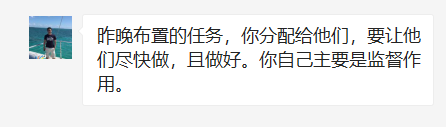

1. 按照 经典论文(问题或者算法的提出者), 经典应用, 引用多, 综述 的顺序降序找文章.

2. 51个分类权重不一样: 有些内容可能包含很多,就需要找较多一些文章, 也会有些交叉.
   问题的话就找最初提出的, 并且是用最经典的算法求解. 算法的话就找经典应用.
   不重要的部分可以少找一点.

3. 大家分一下工,我已经写好list 如果有更好的想法,可以直接加入或者修改. 大家商量一个截止日期,
   这个应该很快,但是希望大家不要光看引用,至少把文章的结构过一遍,筛选一下.

4. 最后每个人汇总一个压缩包给我, 里面是你负责的部分(excel文件标好号)以及引用信息.
   相应的pdf(用年份-文章名字命名).

